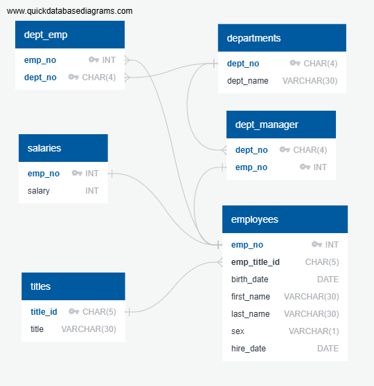

# sql_challenge
SQL challenge as data engineer at Pewlett Hackard (fictional company)

# Data Modeling

## Entity Relationship Diagram

# Data Engineering

[EmployeeSQL Data Engineering Script](EmployeeSQL/QuickDBD-EmployeeSQL_DB_table_schemata_updated.sql)

## Data Analysis

[Data Analysis Script](EmployeeSQL/data_analysis_updated.sql)

