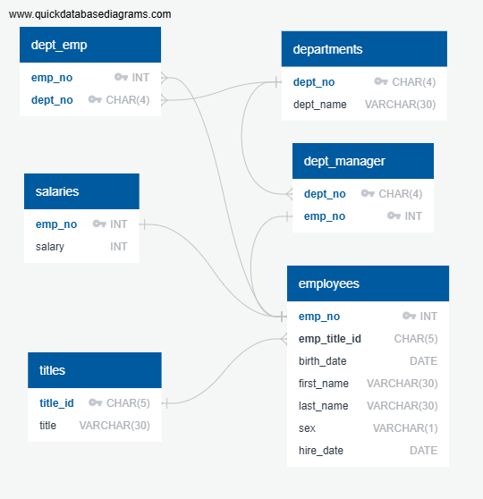

# sql_challenge
SQL challenge as data engineer at Pewlett Hackard (fictional company)

# Data Modeling

## Entity Relationship Diagram

# Data Engineering

The physical schema is given below. The  EmployeeSQL_DB Documentation can also be viewed from the file [EmployeeSQL_DB_Physical_schema.pdf](EmployeeSQL_DB_Physical_Schema_updated.pdf)

## EmployeeSQL Physical_schema.txt

employees
-
emp_no INT PK 
emp_title_id CHAR(5) FK >- titles.title_id
birth_date DATE
first_name VARCHAR(30)
last_name VARCHAR(30)
sex VARCHAR(1)
hire_date DATE

departments
-
dept_no CHAR(4) PK 
dept_name VARCHAR(30)

dept_emp
-
emp_no INT PK FK >- employees.emp_no
dept_no CHAR(4) PK FK >- departments.dept_no

dept_manager
-
dept_no CHAR(4) PK FK >- departments.dept_no
emp_no INT PK FK - employees.emp_no

titles
-
title_id CHAR(5) PK 
title VARCHAR(30)

salaries
-
emp_no INT PK FK - employees.emp_no
salary INT 

# EmployeeSQL.sql

-- Exported from QuickDBD: https://www.quickdatabasediagrams.com/  
-- Link to schema: https://app.quickdatabasediagrams.com/#/d/JLW7Qo
-- NOTE! If you have used non-SQL datatypes in your design, you will have to change these here.

-- EmployeeSQL Physical_schema.txt

CREATE TABLE  employees  (
     emp_no  INT   NOT NULL,
     emp_title_id  CHAR(5)   NOT NULL,
     birth_date  DATE   NOT NULL,
     first_name  VARCHAR(30)   NOT NULL,
     last_name  VARCHAR(30)   NOT NULL,
     sex  VARCHAR(1)   NOT NULL,
     hire_date  DATE   NOT NULL,
    CONSTRAINT  pk_employees  PRIMARY KEY (
         emp_no 
     )
);

CREATE TABLE  departments  (
     dept_no  CHAR(4)   NOT NULL,
     dept_name  VARCHAR(30)   NOT NULL,
    CONSTRAINT  pk_departments  PRIMARY KEY (
         dept_no 
     )
);

CREATE TABLE  dept_emp  (
     emp_no  INT   NOT NULL,
     dept_no  CHAR(4)   NOT NULL,
    CONSTRAINT  pk_dept_emp  PRIMARY KEY (
         emp_no , dept_no 
     )
);

CREATE TABLE  dept_manager  (
     dept_no  CHAR(4)   NOT NULL,
     emp_no  INT   NOT NULL,
    CONSTRAINT  pk_dept_manager  PRIMARY KEY (
         dept_no , emp_no 
     )
);

CREATE TABLE  titles  (
     title_id  CHAR(5)   NOT NULL,
     title  VARCHAR(30)   NOT NULL,
    CONSTRAINT  pk_titles  PRIMARY KEY (
         title_id 
     )
);

CREATE TABLE  salaries  (
     emp_no  INT   NOT NULL,
     salary  INT   NOT NULL,
    CONSTRAINT  pk_salaries  PRIMARY KEY (
         emp_no 
     )
);

ALTER TABLE  employees  ADD CONSTRAINT  fk_employees_emp_title_id  FOREIGN KEY( emp_title_id )
REFERENCES  titles  ( title_id );

ALTER TABLE  dept_emp  ADD CONSTRAINT  fk_dept_emp_emp_no  FOREIGN KEY( emp_no )
REFERENCES  employees  ( emp_no );

ALTER TABLE  dept_emp  ADD CONSTRAINT  fk_dept_emp_dept_no  FOREIGN KEY( dept_no )
REFERENCES  departments  ( dept_no );

ALTER TABLE  dept_manager  ADD CONSTRAINT  fk_dept_manager_dept_no  FOREIGN KEY( dept_no )
REFERENCES  departments  ( dept_no );

ALTER TABLE  dept_manager  ADD CONSTRAINT  fk_dept_manager_emp_no  FOREIGN KEY( emp_no )
REFERENCES  employees  ( emp_no );

ALTER TABLE  salaries  ADD CONSTRAINT  fk_salaries_emp_no  FOREIGN KEY( emp_no )
REFERENCES  employees  ( emp_no );

## 2. Importing CSV files into its corresponding SQL table.

Due to the presence of Foreign Keys (FK) in many tables, the titles and departments tables were first populated as these have definition for the FKs, followed by the tables employees, salaries, dept_emp and dept_manager. 
The date format had to be altered to allow for import of data for the employees table as follows:
SET DATESTYLE TO "ISO, MDY";  
alter database "EmployeeSQL_DB" set datestyle='MDY';

# Data Analysis

## Verify data in all tables

SELECT * FROM employees;

SELECT * FROM departments;

SELECT * FROM dept_emp;

SELECT * FROM dept_manager;

SELECT * FROM salaries;

SELECT * FROM titles;

## Data Analysis

The sql file for the data Analysis can be access from [here] (data_analysis_updated.sql)

-- 1. List the employee number, last name, first name, sex, and salary of each employee.

SELECT e.emp_no, e.last_name, e.first_name, e.sex, s.salary
FROM employees as e
INNER JOIN salaries as s
ON e.emp_no = s.emp_no;

-- 2. List the first name, last name, and hire date for the employees who were hired in 1986.

SELECT first_name, last_name, hire_date
FROM employees
WHERE hire_date BETWEEN '1986-01-01' AND '1986-12-31';

--3 List the manager of each department along with their department number, department name, employee number, last name, and first name.

SELECT d.dept_no, d.dept_name, dm.emp_no, e.last_name, e.first_name
FROM departments as d
INNER JOIN dept_manager as dm
ON d.dept_no = dm.dept_no
INNER JOIN employees as e
ON dm.emp_no = e.emp_no;

-- 4. List the department number for each employee along with that employee’s employee number, last name, first name, and department name

SELECT de.dept_no, de.emp_no, e.last_name, e.first_name, d.dept_name
FROM dept_emp as de
INNER JOIN employees as e
ON de.emp_no = e.emp_no
INNER JOIN departments as d
ON de.dept_no = d.dept_no;

-- 5. List first name, last name, and sex of each employee whose first name is Hercules and whose last name begins with the letter B 

SELECT  first_name, last_name,  sex
FROM employees
WHERE first_name = 'Hercules'
AND last_name LIKE 'B%';

-- 6. List each employee in the Sales department, including their employee number, last name, and first name

SELECT de.emp_no, e.last_name, e.first_name, d.dept_name
FROM dept_emp as de
INNER JOIN departments as d
ON de.dept_no = d.dept_no
INNER JOIN employees as e
ON de.emp_no = e.emp_no
WHERE d.dept_name = 'Sales';

-- 7. List each employee in the Sales and Development departments, including their employee number, last name, first name, and department name.

SELECT e.emp_no,
       e.last_name,
       e.first_name,
       d.dept_name
FROM employees e
JOIN dept_emp de ON e.emp_no = de.emp_no
JOIN departments d ON de.dept_no = d.dept_no
WHERE d.dept_name IN ('Sales', 'Development');

-- 8 List the frequency counts, in descending order, of all the employee last names (that is, how many employees share each last name).

SELECT last_name, COUNT(*) AS frequency_count
FROM employees
GROUP BY last_name
ORDER BY frequency_count DESC;

